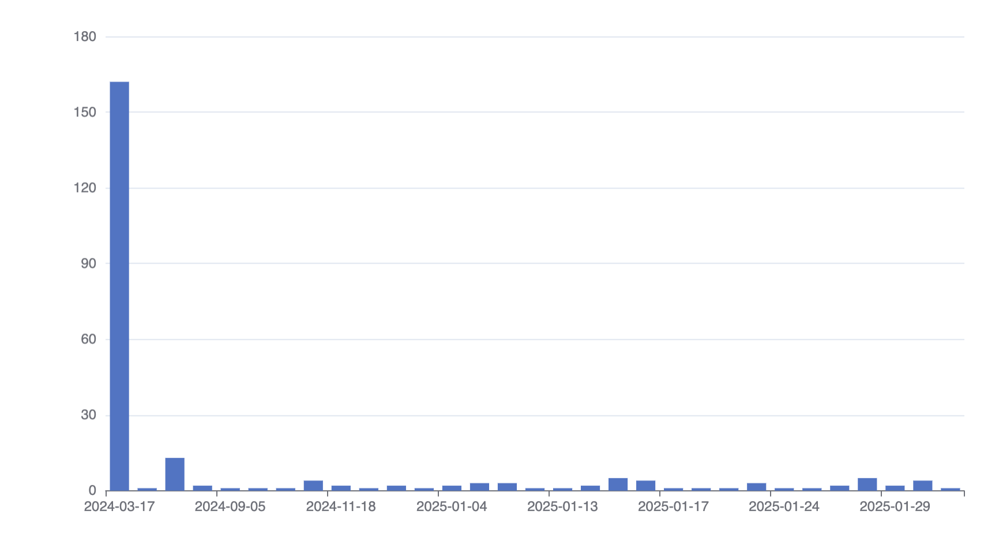

# SQLSeal Charts

SQLSeal Charts is an extension for SQLSeal Obsidian Plugin allowing to visualise your data using charts!

Powered by [ECharts](https://echarts.apache.org/en/index.html). Check their documentation for more examples of usage.

## Features
- Support for basic charts: line, bar, pie charts
- Support for compex charts like scatterplot, heatmap, etc.

## Getting started
Install the plugin by downloading latest release and unpacking it in `.obsidian/plugins/sqlseal-charts`. Make sure you have SQLSeal plugin already installed.

## Example query

### Pie Chart

Query below takes the first table in your current markdown tile and displays it as a piechart.

| Category      | Amount |
| ------------- | ------ |
| Rent          | 1500   |
| Groceries     | 200    |
| Entertainment | 150    |
| Repairs       | 200    |

```sqlseal
TABLE finances = table(0)

CHART {
	series: [{
		type: 'pie'
	}]
}
SELECT * FROM finances
```


### Line Chart
```sqlseal
CHART {
	xAxis: {
		type: 'category'
	},
	yAxis: {},
		series: [{
		type: 'bar',
		}]
}
SELECT
	strftime("%Y-%m-%d", created_at) as created_date,
	COUNT(*) as count
FROM files
GROUP BY created_date
ORDER BY created_date
```




## Syntax
SQLSeal Charts uses [ECharts](https://echarts.apache.org/en/index.html) under the hood. It automatically exposes data returned by your SQL query as a `data` dataset in ECharts. This means you can generate plenty of charts without worrying too much about how the data is being passed down. For more complex use-cases, you can always refer to the data by column name, it's index or even filter it down to create separate data-sets for different series.
To read more about datasets, [check out ECharts documentation](https://apache.github.io/echarts-handbook/en/concepts/dataset/).

For more advanced transformations, SQLSeal Charts exposes the following data and functions to be used to transform data further.

### Data
| Variable Name          | Description                                                                                                                                      |
| ---------------------- | ------------------------------------------------------------------------------------------------------------------------------------------------ |
| `data`                 | Array of objects containing raw data                                                                                                             |
| `columns`              | array of column names                                                                                                                            |
| Object for each column | You can refer to each of the column data by their name, i.e. for `SELECT category, amount FROM data` you can use `category` and `amount` columns |

### Functions
The following functions are exposed in your query to allow you to further process data.

| Function                                                            | Description                                                                                                                                          |
| ------------------------------------------------------------------- | ---------------------------------------------------------------------------------------------------------------------------------------------------- |
| `column(name: string)`                                              | Returns array of the values for a specified column                                                                                                   |
| `mean, max, min, uniq, uniqBy`                                      | [Lodash](https://lodash.com/docs/4.17.15) functions to help with data processing                                                                     |
| `array(...arrays)`                                                  | creates subarrays from arrays, i.e. `array([1,2], [3,4 ]) == [[1,3], [2,4]]`. Useful when grouping multiple columns together when reshaping the data |
| `assembleObjects(...definitions: { key: string, values: array }[])` | Assembles multiple arrays into array of objects using provided key values                                                                            |
| `assemble(definition: Record<string, array>)`                       | Assembles multiple arrays into array of objects using a key=>value map                                                                               |
