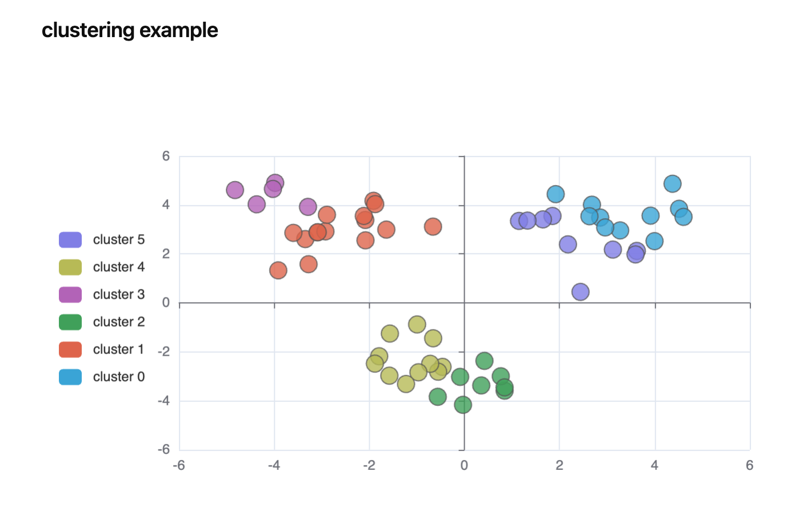
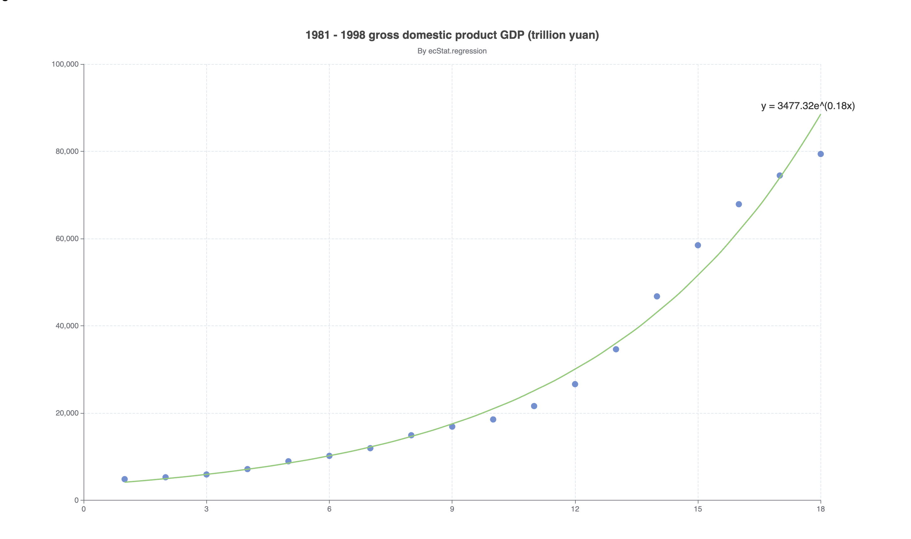

# Data Analysis Features
SQLSeal Chart comes integrated with EChart-Stat module that allows you to perform:
- clustering (i.e. KMeans) 
- regression
- histogram generation

## Enabling the feature
The feature is enabled by default, no extra work is needed

## Examples

### Clustering
You can generate your data cluster. This demo is based on the official demo from ECharts [that can be found here](https://echarts.apache.org/examples/en/editor.html?c=scatter-clustering).



```sqlseal
TABLE clustering = file(./Clustering Data.csv)
ADVANCED MODE
CHART

const datasetArray = data.map(d => ([d.x, d.y]))

var CLUSTER_COUNT = 6;
var DIENSIION_CLUSTER_INDEX = 2;
var COLOR_ALL = [
  '#37A2DA',
  '#e06343',
  '#37a354',
  '#b55dba',
  '#b5bd48',
  '#8378EA',
  '#96BFFF'
];
var pieces = [];
for (var i = 0; i < CLUSTER_COUNT; i++) {
  pieces.push({
    value: i,
    label: 'cluster ' + i,
    color: COLOR_ALL[i]
  });
}
return {
  dataset: [
  {
      source: datasetArray
    },
    {
      transform: {
        type: 'ecStat:clustering',
        print: true,
        config: {
          clusterCount: CLUSTER_COUNT,
          outputType: 'single',
          outputClusterIndexDimension: DIENSIION_CLUSTER_INDEX
        }
      }
    }
  ],
  tooltip: {
    position: 'top'
  },
  visualMap: {
    type: 'piecewise',
    top: 'middle',
    min: 0,
    max: CLUSTER_COUNT,
    left: 10,
    splitNumber: CLUSTER_COUNT,
    dimension: DIENSIION_CLUSTER_INDEX,
    pieces: pieces
  },
  grid: {
    left: 120
  },
  xAxis: {},
  yAxis: {},
  series: {
    type: 'scatter',
    encode: { tooltip: [0, 1] },
    symbolSize: 15,
    itemStyle: {
      borderColor: '#555'
    },
    datasetIndex: 1
  }
};

SELECT * FROM clustering
```


Sample data:
| x         | y          |
| --------- | ---------- |
| 3.275154  | 2.957587   |
| -3.344465 | 2.603513   |
| 0.355083  | -3.376585  |
| 1.852435  | 3.547351   |
| -2.078973 | 2.552013   |
| -0.993756 | -0.884433  |
| 2.682252  | 4.007573   |
| -3.087776 | 2.878713   |
| -1.565978 | -1.256985  |
| 2.441611  | 0.444826   |
| -0.659487 | 3.111284   |
| -0.459601 | -2.618005  |
| 2.17768   | 2.387793   |
| -2.920969 | 2.917485   |
| -0.028814 | -4.168078  |
| 3.625746  | 2.119041   |
| -3.912363 | 1.325108   |
| -0.551694 | -2.814223  |
| 2.855808  | 3.483301   |
| -3.594448 | 2.856651   |
| 0.421993  | -2.372646  |
| 1.650821  | 3.407572   |
| -2.082902 | 3.384412   |
| -0.718809 | -2.492514  |
| 4.513623  | 3.841029   |
| -4.822011 | 4.607049   |
| -0.656297 | -1.449872  |
| 1.919901  | 4.439368   |
| -3.287749 | 3.918836   |
| -1.576936 | -2.977622  |
| 3.598143  | 1.97597    |
| -3.977329 | 4.900932   |
| -1.79108  | -2.184517  |
| 3.914654  | 3.559303   |
| -1.910108 | 4.166946   |
| -1.226597 | -3.317889  |
| 1.148946  | 3.345138   |
| -2.113864 | 3.548172   |
| 0.845762  | -3.589788  |
| 2.629062  | 3.535831   |
| -1.640717 | 2.990517   |
| -1.881012 | -2.485405  |
| 4.606999  | 3.510312   |
| -4.366462 | 4.023316   |
| 0.765015  | -3.00127   |
| 3.121904  | 2.173988   |
| -4.025139 | 4.65231    |
| -0.559558 | -3.840539  |
| 4.376754  | 4.863579   |
| -1.874308 | 4.032237   |
| -0.089337 | -3.026809  |
| 3.997787  | 2.518662   |
| -3.082978 | 2.884822   |
| 0.845235  | -3.454465  |
| 1.327224  | 3.358778   |
| -2.889949 | 3.596178   |
| -0.966018 | -2.839827  |
| 2.960769  | 3.079555   |
| -3.275518 | 1.577068   |
| 0.639276  |  -3.41284 |


### Regression
You can use regression to match a function against your data. Following is the example from ECharts adapted for use in Obsidian:



```sqlseal
TABLE regression = file(./Regression Data.csv)
ADVANCED MODE
CHART
const dataArray = data.map(d => ([d.x, d.y]))

return {
  dataset: [
    {
      source: dataArray
    },
    {
      transform: {
        type: 'ecStat:regression',
        config: {
          method: 'exponential'
          // 'end' by default
          // formulaOn: 'start'
        }
      }
    }
  ],
  title: {
    text: '1981 - 1998 gross domestic product GDP (trillion yuan)',
    subtext: 'By ecStat.regression',
    sublink: 'https://github.com/ecomfe/echarts-stat',
    left: 'center'
  },
  tooltip: {
    trigger: 'axis',
    axisPointer: {
      type: 'cross'
    }
  },
  xAxis: {
    splitLine: {
      lineStyle: {
        type: 'dashed'
      }
    }
  },
  yAxis: {
    splitLine: {
      lineStyle: {
        type: 'dashed'
      }
    }
  },
  series: [
    {
      name: 'scatter',
      type: 'scatter',
      datasetIndex: 0
    },
    {
      name: 'line',
      type: 'line',
      smooth: true,
      datasetIndex: 1,
      symbolSize: 0.1,
      symbol: 'circle',
      label: { show: true, fontSize: 16 },
      labelLayout: { dx: -20 },
      encode: { label: 2, tooltip: 1 }
    }
  ]
}
SELECT * FROM regression
```

Sample data:

| x   | y       |
| --- | ------- |
| 1   | 4862.4  |
| 2   | 5294.7  |
| 3   | 5934.5  |
| 4   | 7171    |
| 5   | 8964.4  |
| 6   | 10202.2 |
| 7   | 11962.5 |
| 8   | 14928.3 |
| 9   | 16909.2 |
| 10  | 18547.9 |
| 11  | 21617.8 |
| 12  | 26638.1 |
| 13  | 34634.4 |
| 14  | 46759.4 |
| 15  | 58478.1 |
| 16  | 67884.6 |
| 17  | 74462.6 |
| 18  | 79395.7 |


### Histogram
Example to be implemented. Check back soon!