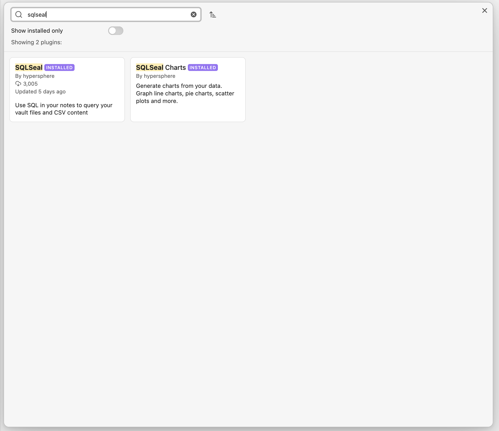
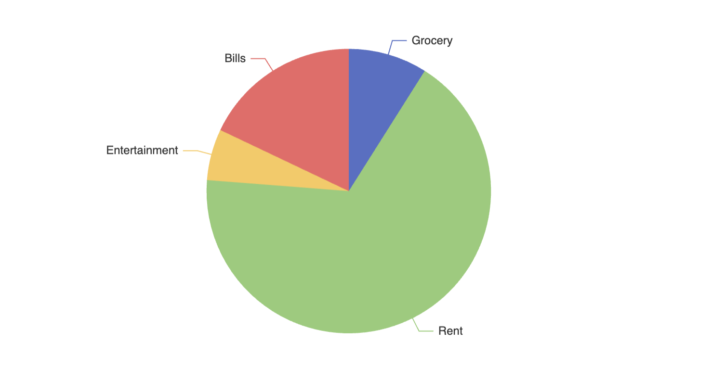

# Quick Start

You get your first chart in less than 5 minutes! To do so, you need to install `SQLSeal` and `SQLSeal Charts`, create sample data source and write a query. This tutorial will guide you through the process step by step. By the end of it, you will get the following chart up and running:

SCREENSHOT HERE

## Installation
Before you start using SQLSeal Charts you need to install it.

> [!NOTE] SQLSeal vs SQLSeal Charts
> SQLSeal Charts **extends functionality of SQLSeal** so in order to use it, you need to install **both**.

- Go to community plugins and click Browse.
- Search for `SQLSeal`
- Install `SQLSeal` first
- Install `SQLSeal Charts` second

Now you have all plugins installed.



## Create dataset
To visualise data, you need the data to visualise. SQLSeal can visualise tables inside your markdown notes, datasets in common data formats (CSV, JSON) and your whole vault collection (your notes properties, etc). In this tutorial we will create a table inside your note which is the easiest way to get started. To learn more about data sources, check out SQLSeal documentation.

Create the following table inside your vault. You can copy the markdown provided below and paste it inside your Obsidian. In the end you should end up with a table.

| Category      | Amount |
| ------------- | ------ |
| Grocery       | 200    |
| Rent          | 1500   |
| Entertainment | 130    |
| Bills         | 400    |

```markdown
| Category      | Amount |
| ------------- | ------ |
| Grocery       | 200    |
| Rent          | 1500   |
| Entertainment | 130    |
| Bills         | 400    |
```

## Link the data
To visualise this data we need to create SQLSeal codeblock. In Obsidian a codeblock is denoted by three backtick symbols \`. If you are not sure how to create the codeblock, you can open your command palette in Obsidian (ctrl or cmd+P) and type `Insert code block`.
Next you need to specify the type of the block. This will tell Obsidian to render it in the Preview mode. you need to put `sqlseal` here.
Inside the code block type the following:
```sqlseal
TABLE data = table(0)
CHART 
{
	series: [{
		type: 'pie'
	}]
}
SELECT * FROM data
```

### Explenation of the code above
The code above might seem quite scary at first but I promise it all makes sense. It consists of 3 main parts:
- Table definition: here we define that we want to expose data from our markdown table as a table called `data`
- The second one is CHART view. This tells SQLSeal we want to render chart (there are other views available in the SQLSeal itself like table, list and grid). I takes configuration which tells it what type of chart we want. In our case we only want a pie chart.
- The last one is an SQL Select statement. Here you can define which data you want to use, combine data from different sources together or process the data. In our case we simply say: tale everything from our data table.

If you did everything correctly, you should see chart like below:



## Extras
The chart you've just created is interactive! You can hover on it but also you can change original data and see the data update accordingly. Try updating the data, adding or removing new rows. To speed up refresh, you can manually save the note by using CMD+S or CTRL+S.